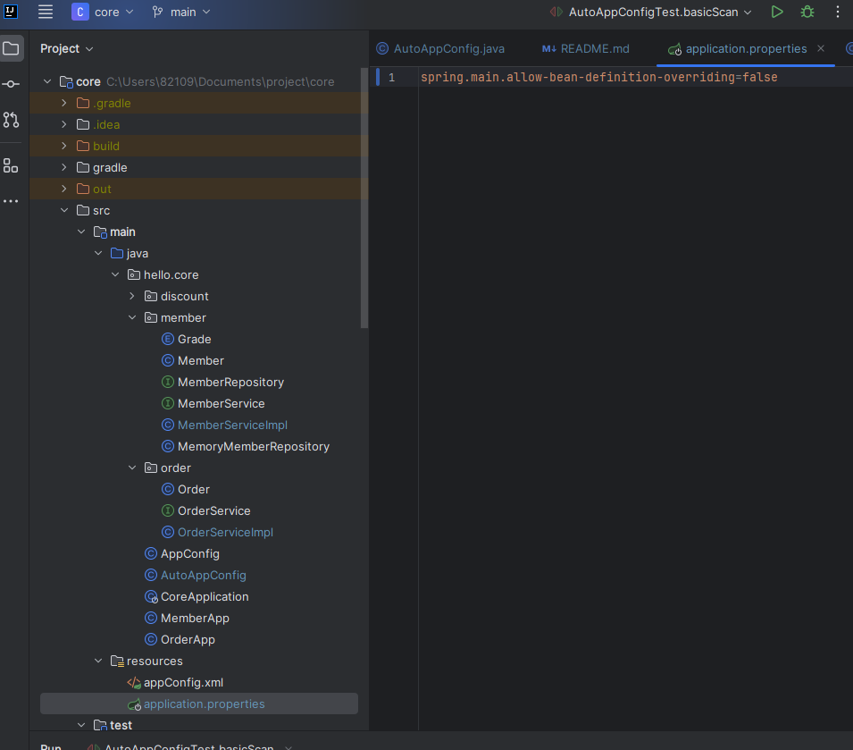

# 스프링 코어 - 김영한 강의 학습

# 스타터 팩같은게 있음

- ref: https://start.spring.io/
- 사진의 조건대로 설정.

# file > setting

Build and Run 부분을 IntelliJ IDEA로 변경 (속도가 더 빠름)

# 단축키
- alt + insert = generate
- alt + enter = 자동수정
- ctrl + shift + enter = 자동완성시 세미클론을 포함하여 출려됨
- CTRL + shift + t = 테스트 코드 자동완성
- ctrl + e = recent file
- iter for문 자동생성
- ctrl + shift + t(클래스명을 타겟으로 잡은상태에서) = 테스트 자동생성
# 테스트 코드 짜는방법
- MemeberServiceTest
- 

# Ioc, DI

# appConfig.xml 설정 방법 및 사용방법 (XmlAppContext테스트 파일로 사용방법 숙지)

# bean meta infomation

# 스프링빈은 항상 무상태로 설계해야한다.

# 최근의 스프링부트는 컴포넌트 스캔을 기본으로 제공하는데, 스프링의 기본설정에 최대한 맞추어 사용하는것을 권장
- 간혹 includeFilter, excludeFilter를 사용하기는 한다.

# 빈등록을 중복으로 지정했을때

자동 등록 빈 vs 자동 등록 빈 :  에러남

수동 등록 빈 vs 자동 등록 빈 : 수동 등록된 빈이 우선권을 가짐.(수동등록된 빈이 자동 등록된 빈을 오버라이딩 한다.)

그러나 이런종류의 내용들은 사이드이펙트의 확률을 높이기에 애초에 중복되게 설정을 안하는게 좋다
(최근의 스프링부트에서는 수동빈과 자동빈 등록이 충돌나면 오류가 발생하도록 기본값을 변경했다고 한다.)

- 아래와 같이 설정하면 수동빈이 자동빈을 오버라이딩하도록 설정할 수 있다.(추천하지 않음)

# 의존관계 주입 방법
1. 생성자 주입

2. 수정자 주입(setter 주입)

3. 필드 주입
- 외부에서 변경이 불가능하기때문에 테스트가 어려기때문에 필드주입은 권장되지 않음, 

- 필드 주입 예시를위한 임시 AppConfig 변경사항.

4. 일반 메서드 주입
- 한번에 여러필드를 주입받을 수 있다.
- 다만 일반적으로 잘 사용되지 않음. 그냥 알아만 두자.

생성자 주입을 권장하니 생성자 주입을 사용하자(사이드 이펙트 관리차원에서 여러 통계의 결과)

# 의존 관계 주입은 스프링 컨테이터가 관리하는 스프링 빈이어야지만 동작한다(당연한 이야기)